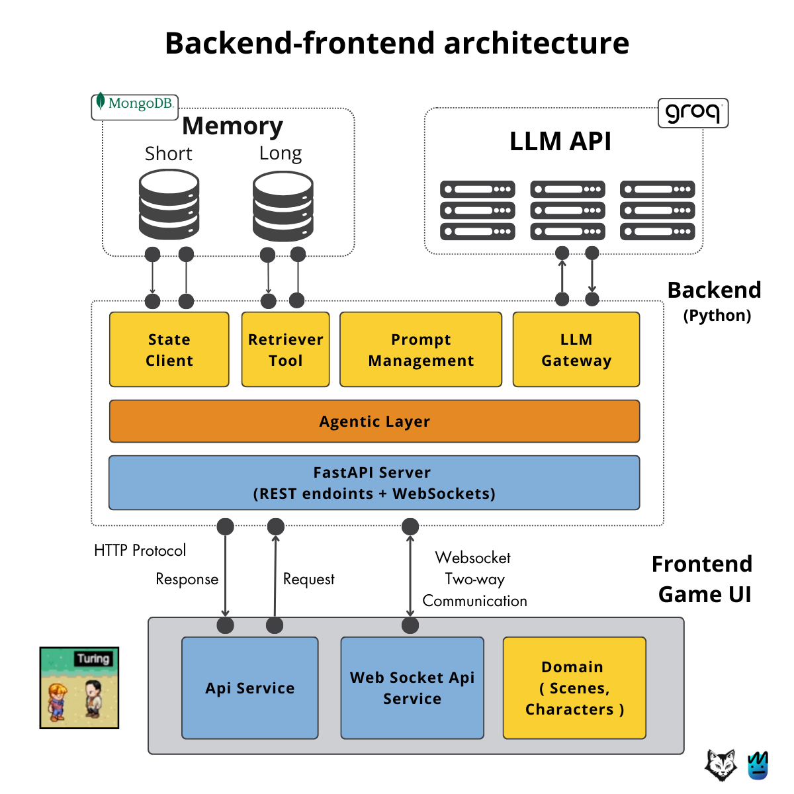
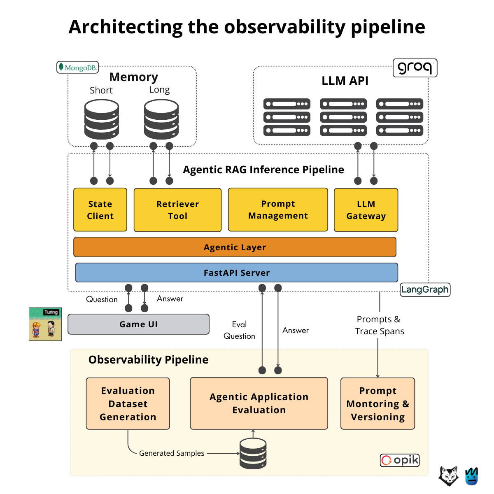
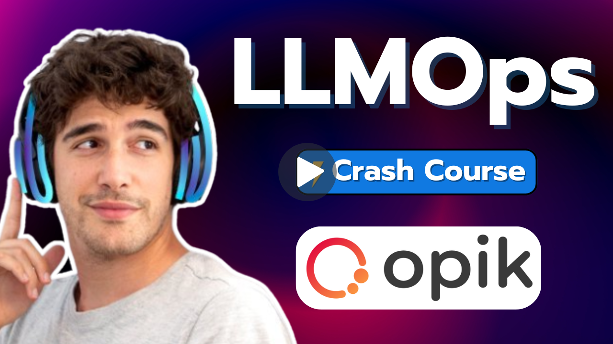
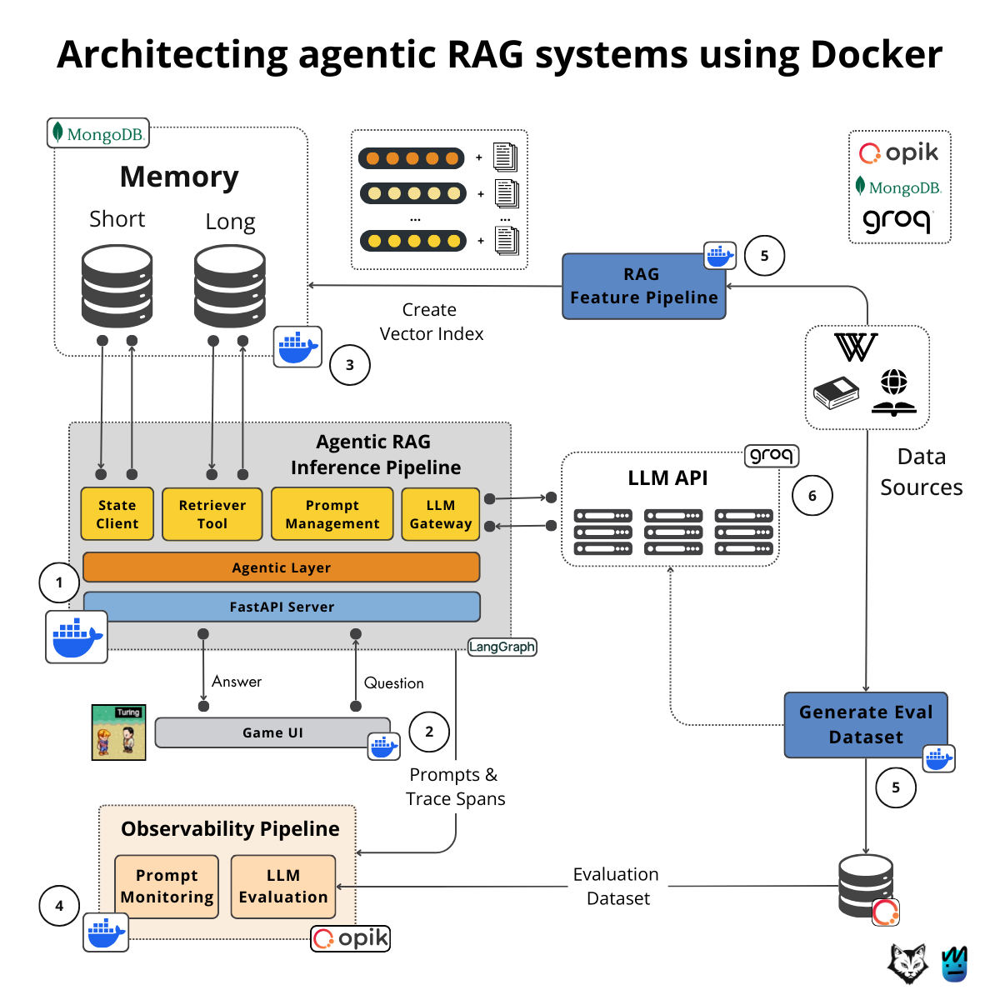
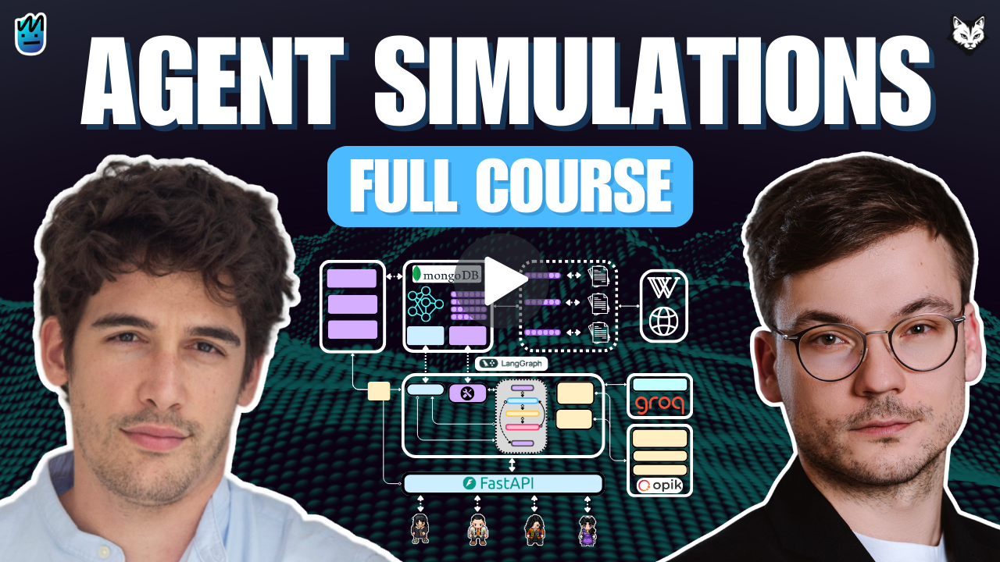

<div align="center">
  <h1>PhiloAgents Course</h1>
  <h3>Learn how to build an AI-powered game simulation engine to impersonate popular philosophers.</h3>
  <p class="tagline">Open-source course by <a href="https://theneuralmaze.substack.com/">The Neural Maze</a> and <a href="https://decodingml.substack.com">Decoding ML</a> in collaboration with </br> <a href="https://rebrand.ly/philoagents-mongodb">MongoDB</a>, <a href="https://rebrand.ly/philoagents-opik">Opik</a> and <a href="https://rebrand.ly/philoagents-groq">Groq</a>.</p>
</div>

</br>

<p align="center">
    
</p>

## 📖 About This Course

Ever dreamed of building your own AI-powered game? Get ready for an exciting journey where we'll combine the thrill of game development with cutting-edge AI technology!

Welcome to **PhiloAgents** (a team-up between [Decoding ML](https://decodingml.substack.com) and [The Neural Maze](https://theneuralmaze.substack.com)) - where ancient philosophy meets modern AI. In this hands-on course, you'll build an AI agent simulation engine that brings historical philosophers to life in an interactive game environment. Imagine having deep conversations with Plato, debating ethics with Aristotle, or discussing artificial intelligence with Turing himself!

**In 6 comprehensive modules**, you'll learn how to:
- Create AI agents that authentically embody historical philosophers
- Master building agentic applications
- Architect and implement a production-ready RAG, LLM and LLMOps system from scratch

### 🎮 The PhiloAgents Experience. What You'll Do:

Transform static NPCs into dynamic AI personalities that:
- Build a game character simulation engine, powered by AI agents and LLMs, that impersonates philosophers from our history, such as Plato, Aristotle and Turing.
- Design production-ready agentic RAG systems.
- Ship the agent as a RESTful API.
- Apply LLMOps and software engineering best practices.
- Use industry tools: Groq, MongoDB, Opik, LangGraph, LangChain, FastAPI, Websockets, Docker, etc.

After completing this course, you'll have access to your own agentic simulation engine, as seen in the video below:

<video src="https://github.com/user-attachments/assets/aedc041e-00ed-42ce-99f2-24ce74847e7a"/></video>

-------

<table style="border-collapse: collapse; border: none;">
  <tr style="border: none;">
    <td width="20%" style="border: none;">
      <a href="https://theneuralmaze.substack.com/" aria-label="The Neural Maze">
        
      </a>
    </td>
    <td width="80%" style="border: none;">
      <div>
        <h2>📬 Stay Updated</h2>
        <p><b><a href="https://theneuralmaze.substack.com/">Join The Neural Maze</a></b> and learn to build AI Systems that actually work, from principles to production. Every Wednesday, directly to your inbox. Don't miss out!
</p>
      </div>
    </td>
  </tr>
</table>

<p align="center">
  <a href="https://theneuralmaze.substack.com/">
    
  </a>
</p>

<table style="border-collapse: collapse; border: none;">
  <tr style="border: none;">
    <td width="20%" style="border: none;">
      <a href="https://decodingml.substack.com/" aria-label="Decoding ML">
        
      </a>
    </td>
    <td width="80%" style="border: none;">
      <div>
        <h2>📬 Stay Updated</h2>
        <p><b><a href="https://decodingml.substack.com/">Join Decoding ML</a></b> for proven content on designing, coding, and deploying production-grade AI systems with software engineering and MLOps best practices to help you ship AI applications. Every week, straight to your inbox.</p>
      </div>
    </td>
  </tr>
</table>

<p align="center">
  <a href="https://decodingml.substack.com/">
    
  </a>
</p>

## 🎯 What You'll Learn

While building the PhiloAgents simulation engine, you'll master:

- Building intelligent agents with LangGraph
  - Agent development and orchestration
  - RAG agentic communication patterns
  - Character impersonation through prompt engineering (Plato, Aristotle, Turing)

- Creating production-grade RAG systems
  - Vector database integration
  - Knowledge base creation from Wikipedia and Stanford Encyclopedia
  - Advanced information retrieval

- Engineering the system architecture
  - End-to-end design (UI → Backend → Agent → Monitoring)
  - RESTful API deployment with FastAPI and Docker
  - Real-time communication via WebSockets

- Implementing advanced agent features
  - Short and long-term memory with MongoDB
  - Dynamic conversation handling
  - Real-time response generation

- Mastering industry tools and practices
  - Integration with Groq, MongoDB, Opik
  - Modern Python tooling (uv, ruff)
  - LangChain and LangGraph ecosystems
  - Leveraging LLMs on GroqCloud for high-speed inference

- Applying LLMOps best practices
  - Automated agent evaluation
  - Prompt monitoring and versioning
  - Evaluation dataset generation

🥷 By the end, you'll be a ninja in production-ready AI agent development!

## 👥 Who Should Join?

**This course is tailored for people who learn by building.** After completing the course, you will have your own code template and enough inspiration to develop your personal agentic applications.

| Target Audience | Why Join? |
|-----------------|-----------|
| ML/AI Engineers | Build production-ready agentic applications (beyond Notebook tutorials). |
| Data/Software Engineers | Architect end-to-end agentic applications. |
| Data Scientists | Implement production agentic systems using LLMOps and SWE best practices. |

## 🎓 Prerequisites

| Category | Requirements |
|----------|-------------|
| **Skills** | - Python (Beginner) <br/> - Machine Learning, LLMs, RAG (Beginner) |
| **Hardware** | Modern laptop/PC (We will use Groq and OpenAI APIs to call our LLMs) |
| **Level** | Beginner to Intermediate |


## 💰 Cost Structure

**The course is open-source and completely free!** You can run the simulation engine without any of the advanced LLMOps features at 0 cost.

If you choose to run the entire system end-to-end (this is optional), the maximum cost for cloud tools is approximately $1:

| Service | Estimated Maximum Cost |
|---------|------------------------|
| Groq's API | $0 |
| OpenAI's API (Optional) | ~$1 |

In Module 5 (optional module), we use OpenAI's API as an LLM-as-a-judge to evaluate our agents. In the rest of the course, we use Groq's API, which offers a free tier.

**Just reading the materials? It's all free!**

## 🥂 Open-source Course: Participation is Open and Free

As an open-source course, you don't have to enroll. Everything is self-paced, free of charge, and with its resources freely accessible at (video and articles are complementary - go through both for the whole picture):
- **code**: this GitHub repository
- **videos**: [The Neural Maze](https://www.youtube.com/@TheNeuralMaze)
- **articles**: [Decoding ML](https://decodingml.substack.com)

## 📚 Course Outline

This **open-source course consists of 6 comprehensive modules** covering theory, system design, and hands-on implementation.

Our recommendation for getting the most out of this course:
1. Clone the repository.
2. Read the materials (video and articles are complementary - go through both for the whole picture)
3. Set up the code and run it to replicate our results.
4. Go deeper into the code to understand the details of the implementation.


| Module | Written Lesson | Video Lesson | Description | Running the code |
|--------|----------------|--------------|-------------|------------------|
| <div align="center">1</div>  | <a href="https://decodingml.substack.com/p/build-your-gaming-simulation-ai-agent"></a> | <a href="https://youtu.be/vbhShB70vFE?si=tK0hRQbEqlZMwFMm"></a> | Architect your gaming simulation AI PhiloAgent. | **No code** |
| <div align="center">2</div> | <a href="https://decodingml.substack.com/p/your-first-production-ready-rag-agent"></a> | <a href="https://youtu.be/5fqkdiTP5Xw?si=Y1erl41qNSYlSaYx"></a> | Building the PhiloAgent in LangGraph using agentic RAG. | [philoagents-api](philoagents-api) |
| <div align="center">3</div> | <a href="https://decodingml.substack.com/p/memory-the-secret-sauce-of-ai-agents"></a> | <a href="https://youtu.be/xDouz4WNHV0?si=t2Wk179LQnSDY1iL"></a> | Wrapping up our agentic RAG layer by implementing the short-term and long-term memory components. | [philoagents-api](philoagents-api) |
| <div align="center">4</div> | <a href="https://decodingml.substack.com/p/deploying-agents-as-real-time-apis"></a>  | <a href="https://youtu.be/svABzOASrzg?si=nylMpFm0nozPNSbi"></a> | Expose the agent as a RESTful API (FastAPI + Websockets). | [philoagents-api](philoagents-api) |
| <div align="center">5</div> | <a href="https://decodingml.substack.com/p/observability-for-rag-agents"></a>  | <a href="https://youtu.be/Yy0szt5OlNI?si=otYpqM_BY2gxdxnS"></a> | Observability for RAG agents (part of LLMOps): evaluating agents, prompt monitoring, prompt versioning, etc. | [philoagents-api](philoagents-api) |
| <div align="center">6</div> | <a href="https://decodingml.substack.com/p/engineer-python-projects-like-a-pro"></a>   | **No video** | Structuring Python projects like a PRO. Modern Python tooling. Docker setup. | [philoagents-api](philoagents-api) |

And if you're feeling extra brave, there's also a 2h 30m video course where we have merged all the video lessons into one.

<p align="center">
    <a href="https://youtu.be/pg1Sn9rsFak?si=bKMdL-EbaMb90PT3"></a>
</p>


------

<table style="border-collapse: collapse; border: none;">
  <tr style="border: none;">
    <td width="20%" style="border: none;">
      <a href="https://theneuralmaze.substack.com/" aria-label="The Neural Maze">
        
      </a>
    </td>
    <td width="80%" style="border: none;">
      <div>
        <h2>📬 Stay Updated</h2>
        <p><b><a href="https://theneuralmaze.substack.com/">Join The Neural Maze</a></b> and learn to build AI Systems that actually work, from principles to production. Every Wednesday, directly to your inbox. Don't miss out!
</p>
      </div>
    </td>
  </tr>
</table>

<p align="center">
  <a href="https://theneuralmaze.substack.com/">
    
  </a>
</p>

<table style="border-collapse: collapse; border: none;">
  <tr style="border: none;">
    <td width="20%" style="border: none;">
      <a href="https://decodingml.substack.com/" aria-label="Decoding ML">
        
      </a>
    </td>
    <td width="80%" style="border: none;">
      <div>
        <h2>📬 Stay Updated</h2>
        <p><b><a href="https://decodingml.substack.com/">Join Decoding ML</a></b> for proven content on designing, coding, and deploying production-grade AI systems with software engineering and MLOps best practices to help you ship AI applications. Every week, straight to your inbox.</p>
      </div>
    </td>
  </tr>
</table>

<p align="center">
  <a href="https://decodingml.substack.com/">
    
  </a>
</p>

## 🏗️ Project Structure

While building the PhiloAgents simulation engine, we will rely on two separate applications:

```bash
.
├── philoagents-api/     # Backend API containing the PhiloAgents simulation engine (Python)
└── philoagents-ui/      # Frontend UI for the game (Node)
```

The course will focus only on the `philoagents-api` application that contains all the agent simulation logic. The `philoagents-ui` application is used to play the game.

## 👔 Dataset

To impersonate our philosopher agents with real-world knowledge, we will populate their long-term memory with data from:
- Wikipedia
- The Stanford Encyclopedia of Philosophy

You don't have to download anything explicitly. While populating the long-term memory, the `philoagents-api` application will download the data from the internet automatically.

## 🚀 Getting Started

Find detailed setup and usage instructions in the [INSTALL_AND_USAGE.md](INSTALL_AND_USAGE.md) file.

**Pro tip:** Read the accompanying articles first for a better understanding of the system you'll build.

## 💡 Questions and Troubleshooting

Have questions or running into issues? We're here to help!

Open a [GitHub issue](https://github.com/neural-maze/philoagents-course/issues) for:
- Questions about the course material
- Technical troubleshooting
- Clarification on concepts

## 🥂 Contributing

As an open-source course, we may not be able to fix all the bugs that arise.

If you find any bugs and know how to fix them, support future readers by contributing to this course with your bug fix.

You can always contribute by:
- Forking the repository
- Fixing the bug
- Creating a pull request

📍 [For more details, see the contributing guide.](CONTRIBUTING.md)

We will deeply appreciate your support for the AI community and future readers 🤗

## Sponsors

<div align="center">
  <table style="border-collapse: collapse; border: none;">
    <tr style="border: none;">
      <td align="center" style="border: none; padding: 20px;">
        <a href="https://rebrand.ly/philoagents-mongodb" target="_blank">
          
        </a>
      </td>
      <td align="center" style="border: none; padding: 20px;">
        <a href="https://rebrand.ly/philoagents-opik" target="_blank">
          
        </a>
      </td>
      <td align="center" style="border: none; padding: 20px;">
        <a href="https://rebrand.ly/philoagents-groq" target="_blank">
          
        </a>
      </td>
    </tr>
  </table>
</div>

## Core Contributors

<table>
  <tr>
    <td align="center">
      <a href="https://github.com/iusztinpaul">
        <br />
        <sub><b>Paul Iusztin</b></sub>
      </a><br />
      <sub>AI/ML Engineer</sub>
    </td>
    <td align="center">
      <a href="https://github.com/MichaelisTrofficus">
        <br />
        <sub><b>Miguel Otero Pedrido</b></sub>
      </a><br />
      <sub>AI/ML Engineer</sub>
    </td>
  </tr>
</table>

## License

This project is licensed under the MIT License - see the [LICENSE](LICENSE) file for details.

------

<table style="border-collapse: collapse; border: none;">
  <tr style="border: none;">
    <td width="20%" style="border: none;">
      <a href="https://theneuralmaze.substack.com/" aria-label="The Neural Maze">
        
      </a>
    </td>
    <td width="80%" style="border: none;">
      <div>
        <h2>📬 Stay Updated</h2>
        <p><b><a href="https://theneuralmaze.substack.com/">Join The Neural Maze</a></b> and learn to build AI Systems that actually work, from principles to production. Every Wednesday, directly to your inbox. Don't miss out!
</p>
      </div>
    </td>
  </tr>
</table>

<p align="center">
  <a href="https://theneuralmaze.substack.com/">
    
  </a>
</p>

<table style="border-collapse: collapse; border: none;">
  <tr style="border: none;">
    <td width="20%" style="border: none;">
      <a href="https://decodingml.substack.com/" aria-label="Decoding ML">
        
      </a>
    </td>
    <td width="80%" style="border: none;">
      <div>
        <h2>📬 Stay Updated</h2>
        <p><b><a href="https://decodingml.substack.com/">Join Decoding ML</a></b> for proven content on designing, coding, and deploying production-grade AI systems with software engineering and MLOps best practices to help you ship AI applications. Every week, straight to your inbox.</p>
      </div>
    </td>
  </tr>
</table>

<p align="center">
  <a href="https://decodingml.substack.com/">
    
  </a>
</p>
